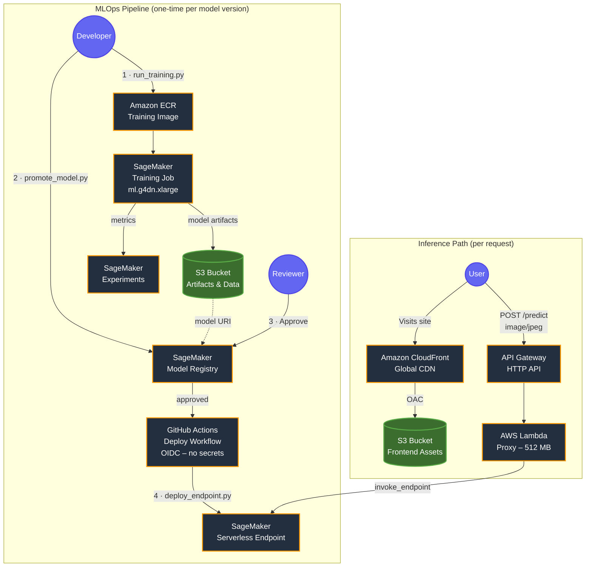

# MLOps End-to-End Hotdog Classifier

**Live Demo (CloudFront URL)**: [https://d1un7sp3ldhfof.cloudfront.net](https://d1un7sp3ldhfof.cloudfront.net)

A fully serverless MLOps pipeline on AWS that trains, versions, approves, and deploys a hotdog/not-hotdog image classifier — end to end. The model is a fine-tuned ResNet-18 achieving **~89% test accuracy**, served via a SageMaker Serverless Endpoint behind API Gateway and CloudFront.

Infrastructure is defined entirely with **AWS CDK (Python)**. Deployment is keyless via **GitHub Actions OIDC** — no stored AWS credentials.

---

## Architecture



---

## Pipeline Steps

### 1 · Train
`run_training.py` performs pre-flight checks (ECR image exists, training data in S3), then launches a SageMaker Training Job using a custom PyTorch Docker image from ECR. Training metrics (`train_loss`, `train_acc`, `test_loss`, `test_acc`) are streamed into **SageMaker Experiments** for comparison across runs. Spot instances are used to reduce cost by up to 70%.

```bash
python run_training.py
```

### 2 · Register
`promote_model.py` finds the latest completed training job (or accepts a job name as argument), reads its final metrics, and registers the model artifact in **SageMaker Model Registry** with status `PendingManualApproval`.

```bash
python promote_model.py                        # latest completed job
python promote_model.py hotdog-train-dev-xyz   # specific job
```

### 3 · Approve
A human reviews metrics in the Model Registry and approves the package via CLI:

```bash
aws sagemaker update-model-package \
  --model-package-arn <arn> \
  --model-approval-status Approved \
  --region us-west-2
```

### 4 · Deploy
Triggering the **GitHub Actions** workflow (`Deploy Hotdog Classifier`) kicks off `deploy_endpoint.py`, which:
- Fetches the latest approved model package from the registry
- Repackages `model.tar.gz` to inject `inference.py` under `code/`
- Creates or updates a **SageMaker Serverless Endpoint** (scales to zero, pay-per-request)

Authentication is fully keyless — GitHub's OIDC token is exchanged for temporary AWS credentials via the IAM role created in the CDK stack.

### 5 · Invoke
Test the live endpoint directly:

```bash
aws sagemaker-runtime invoke-endpoint \
  --endpoint-name hotdog-classifier-dev \
  --content-type image/jpeg \
  --body fileb://hotdog.jpg \
  --region us-west-2 \
  response.json && cat response.json
# → {"class": "hotdog", "confidence": 0.9897}
```

---

## Components

| Component | AWS Service | Purpose |
|---|---|---|
| `TrainingStack` (CDK) | S3, ECR, IAM, SSM, SageMaker | Training infra + OIDC deploy role |
| `InferenceStack` (CDK) | Lambda, API Gateway, S3, CloudFront | Serving frontend + proxy |
| `run_training.py` | SageMaker Training Jobs | Launch + track training runs |
| `promote_model.py` | SageMaker Model Registry | Version and register model artifacts |
| `deploy_endpoint.py` | SageMaker Serverless Inference | Repackage + create/update endpoint |
| `inference.py` | SageMaker PyTorch DLC | `model_fn` / `predict_fn` serving handler |
| `lambda/predict.py` | AWS Lambda | Thin proxy — forwards image to SageMaker |
| `.github/workflows/deploy.yml` | GitHub Actions | CI/CD deploy triggered manually or on approval |

---

## Deployment

### Prerequisites
- Python 3.11+, Node.js (for CDK CLI), Docker
- AWS CLI configured (`aws configure`)
- `cdk bootstrap` run once in `us-west-2`

### 1 · Build and push the training image

```bash
aws ecr get-login-password --region us-west-2 | \
  docker login --username AWS --password-stdin <account>.dkr.ecr.us-west-2.amazonaws.com

docker build -f Dockerfile.train -t hotdog-train .
docker tag hotdog-train:latest <ecr-repo-uri>:latest
docker push <ecr-repo-uri>:latest
```

### 2 · Deploy CDK stacks

```bash
cd infra
pip install -r requirements.txt
cdk deploy HotdogTrainingStack-dev
cdk deploy HotdogInferenceStack-dev
```

### 3 · Upload training data to S3

```bash
aws s3 sync data/ s3://<bucket-name>/data/ --region us-west-2
```

### 4 · Run the pipeline

```bash
python run_training.py        # launch training job
python promote_model.py       # register model in registry
# approve via CLI (see Step 3 above)
# trigger GitHub Actions → Deploy Hotdog Classifier
```

---

## Security

- **Least-privilege IAM**: SageMaker role scoped to its own S3 bucket and ECR repo. Lambda role scoped to `sagemaker:InvokeEndpoint` on the specific endpoint ARN only.
- **Keyless CI/CD**: GitHub Actions uses OIDC — no `AWS_ACCESS_KEY_ID` or `AWS_SECRET_ACCESS_KEY` stored anywhere. Trust is scoped to `repo:hwong5208/mlops-hotdog-pipeline:*`.
- **Origin Access Control**: CloudFront serves the frontend via OAC; the S3 bucket blocks all public access.
- **Serverless endpoint**: SageMaker Serverless Inference scales to zero when idle — no always-on instance costs.
- **Spot training**: SageMaker Managed Spot Training with a 30-minute max runtime cap prevents runaway costs.
